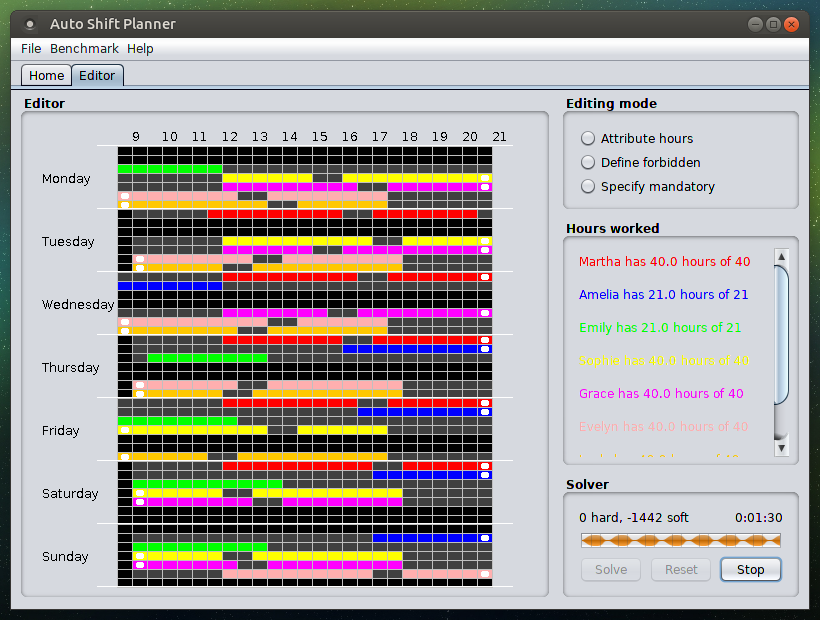
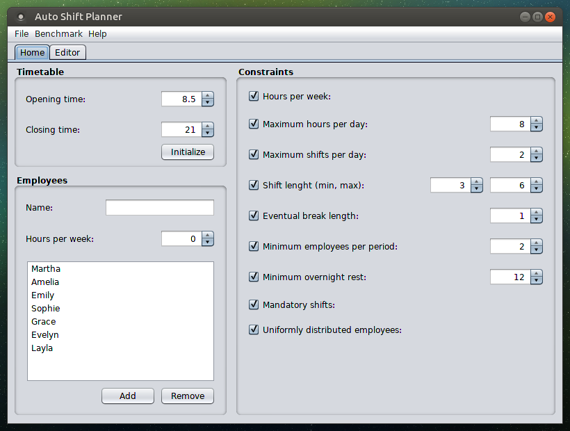

Please, refer to the project [webpage](https://betaiotazeta.github.io/AutoShiftPlanner) for additional informations.

* * *

* * *

The application is a **Maven** project: just clone the repository and open the **pom** file in your preferred IDE. Please consider forking the repository on GitHub, contributions are welcome! The application is also an easy example of **Optaplanner** usage with simple code.